<div align="center">

<picture>
  <source media="(prefers-color-scheme: dark)" srcset="banner.svg">
  <source media="(prefers-color-scheme: light)" srcset="banner-light.svg">
  
</picture>

<br>



<br><br>

[](#)
[](#)
[](mailto:d1vyaamishra08@gmail.com)
[](#)


</div>

<br>

## 🧑‍💻 About Me

```ts
const divya: Developer = {
  name: "Divya Prakash Mishra",
  role: "Full Stack Developer",
  location: "India",
  stack: ["React", "Vue.js", "TypeScript", "Next.js", "Node.js", "Express", "SQL", "AWS", "Docker"],
  currentFocus: "Building fast, scalable web products end-to-end",
  funFact: "I turn caffeine into code. ☕",
};
```

- 🔭 Currently building full-stack products with **React / Next.js** on the front end and **Node.js / Express** on the back end
- ⚡ Comfortable across the stack — from **Figma** hand-off to **Docker**-shipped, **AWS**-hosted APIs
- 🌱 Always sharpening **TypeScript** and cloud/DevOps skills
- 💬 Ask me about React, Vue, Node.js, or SQL — happy to help
- 📫 Reach me at **d1vyaamishra08@gmail.com**

<br>

## 🛠️ Tech Stack

<div align="center">


</div>

<br>

## 📊 GitHub Stats

<div align="center">
<table>
<tr>
<td></td>
<td></td>
</tr>
</table>



</div>

<br>

## 📈 Contribution Activity

<div align="center">


<br><br>

<picture>
  <source media="(prefers-color-scheme: dark)" srcset="https://raw.githubusercontent.com/d1vyamishra/d1vyamishra/output/github-contribution-grid-snake-dark.svg">
  <source media="(prefers-color-scheme: light)" srcset="https://raw.githubusercontent.com/d1vyamishra/d1vyamishra/output/github-contribution-grid-snake.svg">
  
</picture>

</div>

> The snake above is generated daily by [`github-snake.yml`](.github/workflows/github-snake.yml) using [Platane/snk](https://github.com/Platane/snk) and pushed to the `output` branch — make sure that workflow is enabled in **Actions** for it to render.

<br>

## 🚀 Featured Projects

<div align="center">

| Project | Stack | Description | Link |
|---|---|---|---|
| **Project One** | React · Node.js · SQL | Replace with a short one-line pitch for your project. | [Repo](#) |
| **Project Two** | Vue.js · Express · AWS | Replace with a short one-line pitch for your project. | [Repo](#) |
| **Project Three** | Next.js · TypeScript · Docker | Replace with a short one-line pitch for your project. | [Repo](#) |

</div>

> Swap the rows above with your real repositories — name, stack, one-liner, and link.

<br>

<div align="center">

### 💭 Code. Coffee. Repeat.

<sub>Thanks for scrolling all the way down — now go build something. 🚀</sub>

</div>
